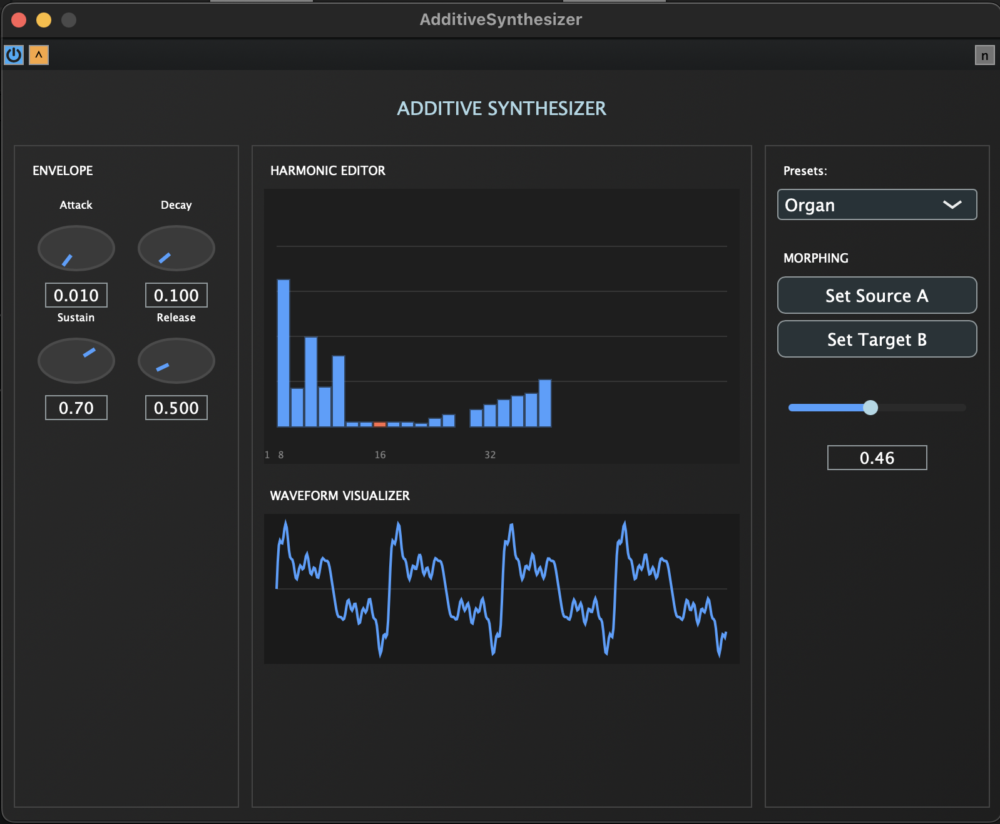

# 🎵 Additive Synthesizer VST Plugin

> **Amateur additive synthesis with interactive harmonic editing and morphing capabilities**


---

## ✨ Features

- 🎛️ **128 Harmonics** - Full control over individual harmonic amplitudes and phases
- 🎨 **Visual Harmonic Editor** - Interactive drag-and-drop harmonic manipulation
- 🔄 **Advanced Morphing** - Smooth transitions between harmonic states
- 📊 **Real-time Visualizer** - Live waveform and spectrum display
- 🎹 **16-Voice Polyphony** - Professional-grade voice management
- 🎚️ **Full ADSR Envelope** - Per-voice amplitude envelope control
- 💾 **Preset System** - Classic waveforms (Saw, Square, Triangle, Sine, Organ)
- 🌙 **Modern Dark UI** - Professional plugin aesthetics

---

## 🚀 Quick Start

### Prerequisites
- [JUCE Framework 7.0+](https://juce.com/get-juce)
- C++17 compatible compiler
- CMake 3.15+ (optional)

### Installation

#### Method 1: JUCE Projucer (Recommended)
```bash
# 1. Clone the repository
git clone https://github.com/yourusername/additive-synthesizer.git
cd additive-synthesizer

# 2. Open in Projucer
# - Launch JUCE Projucer
# - File → Open → Select AdditiveSynthesizer.h
# - Click "Save and Open in IDE"

# 3. Build and run!
```

#### Method 2: PIP (Single File)
```bash
# Simply open AdditiveSynthesizer.h in JUCE Projucer
# The PIP format is auto-detected and generates the full project
```

#### Method 3: CMake Build
```bash
mkdir build && cd build
cmake ..
cmake --build . --config Release
```

---

## 🎮 User Guide

### Basic Usage

1. **Load a Preset**
   - Select from dropdown: Saw, Square, Triangle, Sine, or Organ
   - Presets initialize harmonic patterns automatically

2. **Edit Harmonics**
   - Click and drag on harmonic bars to adjust amplitude
   - Selected harmonic highlighted in red
   - Real-time waveform updates as you edit

3. **Morph Between Sounds**
   ```
   Step 1: Create/load your first sound
   Step 2: Click "Set Source A"
   Step 3: Create/load a different sound
   Step 4: Click "Set Target B"
   Step 5: Move morph slider to blend between A and B
   ```

4. **Shape Your Sound**
   - **Attack**: How quickly sound reaches full volume
   - **Decay**: Time to fall from peak to sustain level
   - **Sustain**: Held volume level while note is pressed
   - **Release**: Time to fade out after note release

### Keyboard Shortcuts
- **Click** - Select harmonic
- **Drag** - Adjust harmonic amplitude
- **Mouse Wheel** - Fine-tune selected harmonic

---

## 🏗️ Architecture

### Project Structure
```
AdditiveSynth/
├── Source/
│   ├── Core/                    # Synthesis engine
│   │   ├── HarmonicState        # Harmonic data management
│   │   ├── HarmonicOscillator   # Additive oscillator
│   │   ├── AdditiveVoice        # Voice implementation
│   │   └── VoiceManager         # Polyphony management
│   ├── DSP/                     # Digital signal processing
│   │   ├── SineWaveGenerator    # Efficient sine synthesis
│   │   ├── EnvelopeProcessor    # ADSR envelope
│   │   ├── MorphingEngine       # State interpolation
│   │   └── FilterProcessor      # Audio filtering
│   ├── GUI/                     # User interface
│   │   ├── HarmonicEditor       # Interactive editor
│   │   ├── HarmonicVisualizer   # Waveform display
│   │   ├── MorphingController   # Morph controls
│   │   └── PluginEditor         # Main editor
│   └── Plugin/
│       └── PluginProcessor      # Audio processor
```

### Key Components

#### HarmonicState
```cpp
// Manages 128 harmonics with amplitude and phase
struct HarmonicData {
    float amplitude;  // 0.0 to 1.0
    float phase;      // 0 to 2π
    bool enabled;     // On/off state
};
```

#### Additive Synthesis Algorithm
```
For each sample:
    output = 0
    For each harmonic (1 to 128):
        if harmonic.enabled:
            freq = fundamental × harmonic_number
            output += harmonic.amplitude × sin(2π × freq × time + phase)
    output × envelope × velocity
```

---

## 🎛️ Technical Specifications

| Feature | Specification |
|---------|--------------|
| **Harmonics** | 128 independent oscillators |
| **Polyphony** | 16 voices |
| **Sample Rate** | Up to 192 kHz |
| **Bit Depth** | 32-bit float processing |
| **Latency** | < 10ms typical |
| **CPU Usage** | ~15% @ 48kHz (varies with voice count) |
| **Formats** | VST3, AU, Standalone |
| **Platforms** | Windows, macOS, Linux |

---

## 🔧 Building from Source

### Full Project Structure Build

```bash
# Clone repository
git clone https://github.com/yourusername/additive-synthesizer.git
cd additive-synthesizer

# Initialize JUCE submodule
git submodule update --init --recursive

# Build with CMake
mkdir build && cd build
cmake .. -DCMAKE_BUILD_TYPE=Release
cmake --build .

# Or use Projucer
# Open AdditiveSynth.jucer in JUCE Projucer
# Save and open in IDE (Xcode/Visual Studio/Code::Blocks)
# Build in your IDE
```

### Build Options
```cmake
# CMakeLists.txt options
-DBUILD_VST3=ON          # Build VST3 plugin
-DBUILD_AU=ON            # Build AudioUnit (macOS only)
-DBUILD_STANDALONE=ON    # Build standalone application
-DCMAKE_BUILD_TYPE=Release
```

---

## 🎨 Customization

### Adding Custom Presets

```cpp
// In HarmonicState::loadPreset()
else if (presetName == "YourPreset")
{
    // Define your harmonic amplitudes
    harmonics[0].amplitude = 1.0f;   // Fundamental
    harmonics[1].amplitude = 0.5f;   // 2nd harmonic
    harmonics[2].amplitude = 0.33f;  // 3rd harmonic
    // ... up to 128 harmonics
}
```

### Custom Color Scheme

```cpp
// In AdditiveSynthLookAndFeel constructor
setColour(juce::Slider::trackColourId, juce::Colour(0xffYOURCOLOR));
setColour(juce::Slider::thumbColourId, juce::Colours::yourColor);
```

---

## 📊 Performance Tips

1. **Voice Management**
   - Reduce max voices for lower CPU usage
   - Voices auto-release when envelope completes

2. **Harmonic Count**
   - Higher harmonics use more CPU
   - Disable unused harmonics for efficiency

3. **Buffer Size**
   - Larger buffers = lower CPU, higher latency
   - 512 samples recommended for most systems

---

## 🐛 Troubleshooting

### Common Issues

**Plugin doesn't load in DAW**
```
- Ensure plugin is in correct folder:
  Windows: C:\Program Files\Common Files\VST3
  macOS: ~/Library/Audio/Plug-Ins/VST3
  Linux: ~/.vst3
```

**No sound output**
```
- Check MIDI input is connected
- Verify at least one harmonic has amplitude > 0
- Ensure sustain level > 0 in envelope
```

**High CPU usage**
```
- Reduce number of active voices
- Lower sample rate in DAW
- Disable unused high harmonics
```

---

## 🤝 Contributing

Contributions are welcome! Please feel free to submit a Pull Request.

### Development Guidelines
- Follow JUCE coding standards
- Add unit tests for new features
- Update documentation
- Maintain backward compatibility

---

## 📄 License

This project is licensed under the MIT License - see the [LICENSE](LICENSE) file for details.

---

## 🙏 Acknowledgments

- **JUCE Framework** - For the excellent audio plugin framework
- **Additive Synthesis Theory** - Based on classical Fourier synthesis
- **Community** - Thanks to all contributors and testers

---

## 📧 Contact

- **Author**: Your Name
- **Email**: your.email@example.com
- **Website**: https://yourwebsite.com
- **Issues**: https://github.com/yourusername/additive-synthesizer/issues

---

## 🗺️ Roadmap

- [ ] Per-harmonic envelope controls
- [ ] LFO modulation for harmonics
- [ ] FFT-based harmonic analysis from audio
- [ ] Preset browser with favorites
- [ ] MIDI learn for all parameters
- [ ] Undo/redo for harmonic editing
- [ ] Export harmonic states as presets
- [ ] Resizable UI
- [ ] Additional filter types
- [ ] Effects section (reverb, chorus, delay)

---

## 📚 Resources

- [JUCE Documentation](https://docs.juce.com)
- [Additive Synthesis Tutorial](https://en.wikipedia.org/wiki/Additive_synthesis)
- [Audio Programming Theory](https://www.musicdsp.org)
- [VST3 SDK Documentation](https://steinbergmedia.github.io/vst3_doc)

---

<div align="center">

**Made with ❤️ and JUCE**

⭐ Star this repo if you found it helpful!

[Report Bug](https://github.com/yourusername/additive-synthesizer/issues) · [Request Feature](https://github.com/yourusername/additive-synthesizer/issues)

</div>